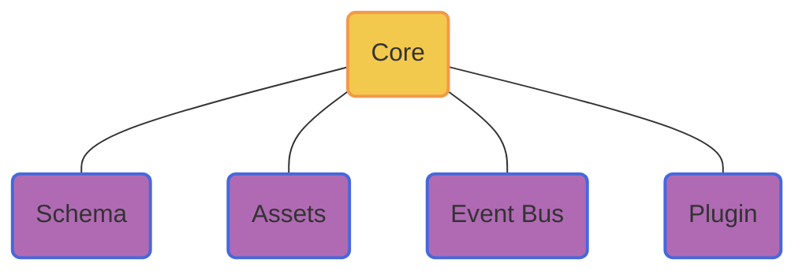

# Core

Global Dispatcher


<div grid="~ cols-2 gap-4" items-center>
<div>


</div>

<div>
<div m-b-9>Core</div>

<div m-b-9 b-b-dotted b-b-3></div>

1. 初始化基础配置
2. 集成插件
3. Schema
4. 事件派发
</div>

</div>

  <!-- style F fill:#6190E8,stroke:#A7BFE8,stroke-width:2px -->

---
transition: slide-left
level: 2
---


# Schema

Schema定义

<div grid="~ cols-2 gap-4">
<div>

```ts {1-10|all}
interface SchemaNode {
  name: string;
  library?: string;
  id?: string;
  props?: SchemaNodeProps;
  slots?: SchemaNodeSlots;
  if?: SchemaNodeBinding;
  for?: SchemaNodeBinding;
  models?: string[];
}

interface SchemaPageNode extends SchemaNode {
  code?: string;
  css?: string;
  ...
}

...

```

</div>

<div>

```ts {1-10|12-21|all}
declare global {
  namespace JSX {
    interface IntrinsicElements {
      page: Exclude<SchemaPageNode, 'slots'>
      slot: { name?: string }
      node: Exclude<SchemaNode, 'slots'>
      t: Exclude<SchemaTextNode, 'slots'>
    }
  }
}

const schema = (
  <page id={id()} code={code} css={css}>
    <node id={id()} library={'Varlet'} name={'Button'}>
      <t id={id()} textContent={'BUTTON 1'} />
    </node>
    <node id={id()} library={'Varlet'} name={'Button'}>
      <t id={id()} textContent={'BUTTON 2'} />
    </node>
  </page>
)

```

</div>

</div>

<!-- TODO: 
{
  id: schemaManager.generateId(),
  name: BuiltInSchemaNodeNames.PAGE,
  code: `\
function setup() {
  const count = ref(1)
  const doubleCount = computed(() => count.value * 2)
  return {
    count,
    doubleCount,
  }
}
`,
  css: 'body {\n  padding: 20px\n}',
  slots: {
    default: {
      children: [
        {
          id: schemaManager.generateId(),
          name: 'Button',
          library: 'Varlet',
          props: {
            type: 'primary',
            onClick: schemaManager.createExpressionBinding('() => { count.value++; }'),
          },
          slots: {
            default: {
              children: [
                {
                  id: schemaManager.generateId(),
                  name: BuiltInSchemaNodeNames.TEXT,
                  textContent: schemaManager.createExpressionBinding('doubleCount.value'),
                },
              ],
            },
          },
        },
      ],
    },
  },
} -->

---
transition: slide-up
level: 2
---

# Assets

静态资源导入

```ts {1-5|7-19|8|10-12|14-16|all}
interface Asset {
  profileLibrary?: string;
  profileResource?: string;
  additionResources?: string[];
}

function createAssetsManager() {
  function importAssets(assets) {}

  // css --> <link rel="stylesheet" href="..." /> 
  // js --> <script src="..." /> 
  function loadResources(resouce) {}

  // const Component = window.{libraryName}.{componentName}
  // h(Component, props, Slot)
  function findComponent(asstes, name, library) {}

  ...
}

```


---
transition: slide-left
level: 2
---

# EventManager

事件派发

```ts {2-3|4-12|13-17|20|all}
export function createEventsManager(): EventsManager {
  const listenerDescriptors: ListenerDescriptor[] = []
  let listenerDescriptorQueue: ListenerDescriptor[] = []

  function on(event: string, listener: Listener) { ... }

  function once(event: string, listener: Listener) { ... }

  function off(event: string, listener: Listener) { ... }

  function emit(event: string, ...args: any[]) { ... }
  
  function has(event: string, listener: Listener) { ... }

  function flushQueue() { ... }

  return { ... }
}

export default createEventsManager()

```

---
level: 2
transition: slide-up
---

# Plugins

插件系统

<div grid="~ cols-2 gap-4">
<div>

```js {2|4-6|8-11|all}
function createPluginsManager() {
  const plugins = []

  const pluginsManager = {
    usePlugin
  }

  function usePlugin(plugin) {
    plugins.push(plugin)
    return pluginsManager
  }

  return pluginsManager
}
```

</div>

<div>
  <Layout />
</div>

</div>
