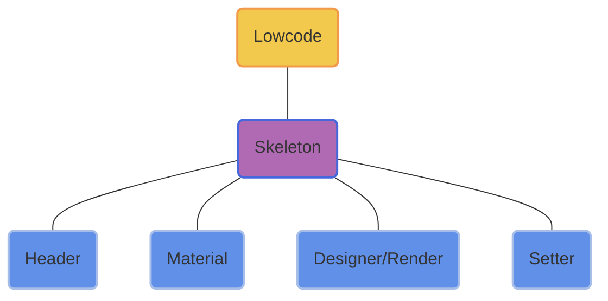
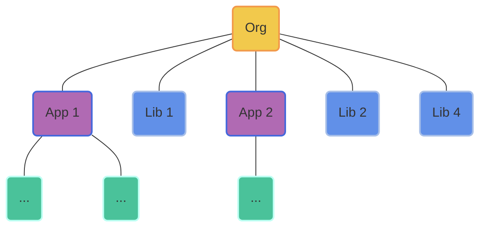

# Lowcode

  
    快速查看 <carbon:arrow-right class="inline"/>
  

  <a href="https://github.com/varletjs/varlet-lowcode" target="_blank" alt="GitHub"
    class="text-xl slidev-icon-btn opacity-50 !border-none !hover:text-white">
    <carbon-logo-github />
  </a>

---
hideInToc: true
---

# Agenda

<Toc></Toc>

---
transition: slide-up
---

# Why this

- 为什么讲这个主题

- 为什么做这个平台

---
transition: slide-left
---

# 开源平台

| | |
| --- | --- |
| 平台名称 | 所属公司 | 
| <kbd>[宜搭](https://cn.aliyun.com/product/yida?from_alibabacloud=)</kbd> | 阿里 |
| <kbd>[formilyjs](https://formilyjs.org/)</kbd> | 阿里 |
| <kbd>[Astro Zero](https://www.huaweicloud.com/product/appcube.html)</kbd> | 华为 |
| <kbd>[通天塔](https://babel.m.jd.com/active/babelCommon/index.html#/)</kbd> | 京东 |
| <kbd>[无极](https://wujicode.cn/xy/app/prod/official/index)</kbd> | 腾讯 |

[更多其他平台](https://github.com/taowen/awesome-lowcode)

---
transition: slide-up
layout: default
---

# Varlet lowcode

一个面向开发者的Vue Lowcode平台

  

    <SkeletonLayout />
  

---
transition: slide-left
---

# Monorepo

A monorepo is a <kbd>single repository</kbd>

containing <kbd>multiple distinct projects</kbd>,

with <kbd>well-defined relationships</kbd>.

 

Monolithic / Multi-repo / Monorepo

1. Simplified code management (dependencies, configs...)
2. Improved code sharing

---
src: ./pages/core.md
---

---
src: ./pages/designer.md
---

---
src: ./pages/selector.md
---

---
image: https://source.unsplash.com/collection/94734566/1920x1080
layout: cover
transition: slide-left
title: Thanks
---

# Thanks

