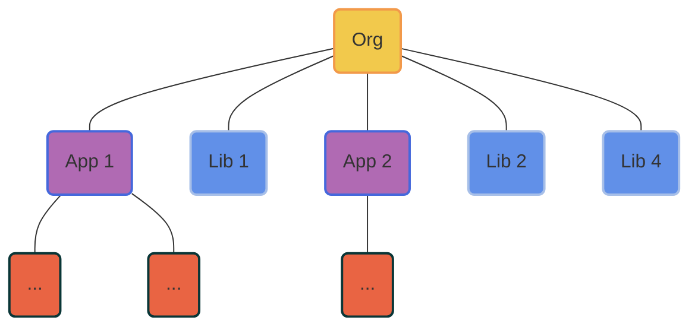

# Lowcode

<div class="pt-12">
  <span @click="$slidev.nav.next" class="px-2 py-1 rounded cursor-pointer" hover="bg-white bg-opacity-10">
    快速查看 <carbon:arrow-right class="inline"/>
  </span>
</div>

<div class="abs-br m-6 flex gap-2">
  <a href="https://github.com/varletjs/varlet-lowcode" target="_blank" alt="GitHub"
    class="text-xl slidev-icon-btn opacity-50 !border-none !hover:text-white">
    <carbon-logo-github />
  </a>
</div>


---
hideInToc: true
---

# Agenda

<Toc></Toc>


---
transition: fade-out
---


# Why this

- 为什么讲这个主题

- 为什么做这个平台


---
transition: slide-up
---

# 开源平台

| | |
| --- | --- |
| 平台名称 | 所属公司 | 
| <kbd>[宜搭](https://cn.aliyun.com/product/yida?from_alibabacloud=)</kbd> | 阿里 |
| <kbd>[formilyjs](https://formilyjs.org/)</kbd> | 阿里 |
| <kbd>[Astro Zero](https://www.huaweicloud.com/product/appcube.html)</kbd> | 华为 |
| <kbd>[通天塔](https://babel.m.jd.com/active/babelCommon/index.html#/)</kbd> | 京东 |
| <kbd>[无极](https://wujicode.cn/xy/app/prod/official/index)</kbd> | 腾讯 |

<div m-t-10px></div>

[更多其他平台](https://github.com/taowen/awesome-lowcode)

<style>
  .slidev-layout td, .slidev-layout th {
    padding-top:.5rem;
    padding-bottom: .5rem;
  }
</style>

---
transition: slide-up
layout: default
---

# Varlet lowcode

一个面向开发者的Vue Lowcode平台


---
transition: slide-up
hideInToc: true
---

## Monorepo

A monorepo is a `single repository` containing `multiple distinct projects`, with `well-defined relationships`.



对比：Monolithic / Multi-repo / Monorepo


1. Simplified code management (dependencies, configs...)
2. Improved code sharing


---
transition: slide-up
hideInToc: true
---

## Plugins

<div grid="~ cols-2 gap-4">
<div>

```js
function createPluginsManager() {
  const plugins = []

  const pluginsManager = {
    usePlugin
  }

  function usePlugin(plugin) {
    plugins.push(plugin)
    return pluginsManager
  }

  return pluginsManager
}
```

</div>
<div>

<Layout />

</div>
</div>


---
transition: slide-up
hideInToc: true
---

## Assets


---
transition: slide-up
hideInToc: true
---

## Schema

```js

const schema = (
  <page id={id()} code={code} css={css}>
    <node id={id()} library={'Varlet'} name={'Button'}>
      <t id={id()} textContent={'BUTTON 1'} />
    </node>
    <node id={id()} library={'Varlet'} name={'Button'}>
      <t id={id()} textContent={'BUTTON 2'} />
    </node>
  </page>
)

```
