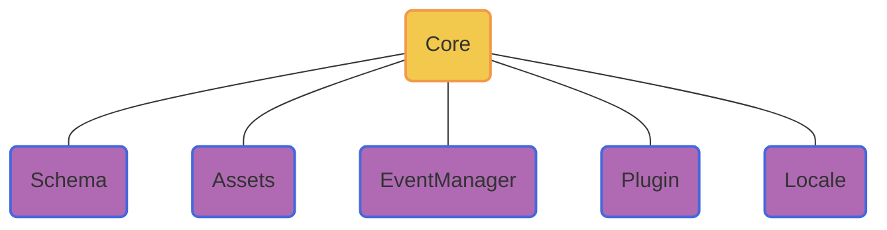

# Lowcode

<div class="pt-12">
  <span @click="$slidev.nav.next" class="px-2 py-1 rounded cursor-pointer" hover="bg-white bg-opacity-10">
    快速查看 <carbon:arrow-right class="inline"/>
  </span>
</div>

<div class="abs-br m-6 flex gap-2">
  <a href="https://github.com/varletjs/varlet-lowcode" target="_blank" alt="GitHub"
    class="text-xl slidev-icon-btn opacity-50 !border-none !hover:text-white">
    <carbon-logo-github />
  </a>
</div>


---
hideInToc: true
---

# Agenda

<Toc></Toc>


---
transition: fade-out
---


# Why this

- 为什么讲这个主题

- 为什么做这个平台


---
transition: slide-up
---

# 开源平台

| | |
| --- | --- |
| 平台名称 | 所属公司 | 
| <kbd>[宜搭](https://cn.aliyun.com/product/yida?from_alibabacloud=)</kbd> | 阿里 |
| <kbd>[formilyjs](https://formilyjs.org/)</kbd> | 阿里 |
| <kbd>[Astro Zero](https://www.huaweicloud.com/product/appcube.html)</kbd> | 华为 |
| <kbd>[通天塔](https://babel.m.jd.com/active/babelCommon/index.html#/)</kbd> | 京东 |
| <kbd>[无极](https://wujicode.cn/xy/app/prod/official/index)</kbd> | 腾讯 |

<div m-t-10px></div>

[更多其他平台](https://github.com/taowen/awesome-lowcode)

<style>
  .slidev-layout td, .slidev-layout th {
    padding-top:.5rem;
    padding-bottom: .5rem;
  }
</style>

---
transition: slide-up
layout: default
---

# Varlet lowcode

一个面向开发者的Vue Lowcode平台

<div grid="~ cols-2 gap-4" items-center>


  <div>
    <SkeletonLayout />
  </div>
</div>

---
transition: slide-up
hideInToc: true
---

# Monorepo

<div grid="~ cols-2 gap-4">
<div>

<div border-l-4 border-l-gray p-l-sm>
A monorepo is a <kbd>single repository</kbd>

containing <kbd>multiple distinct projects</kbd>,

with <kbd>well-defined relationships</kbd>.
</div>

<br/>


</div>

<div>
<div m-b-9>Monolithic / Multi-repo / Monorepo</div>

<div m-b-9 b-b-dotted b-b-3></div>

1. Simplified code management (dependencies, configs...)
2. Improved code sharing
</div>

</div>

---
transition: slide-left
---

# Core

Global Dispatcher


<div grid="~ cols-2 gap-4" items-center>
<div>


</div>

<div>
<div m-b-9>Core</div>

<div m-b-9 b-b-dotted b-b-3></div>

1. 初始化基础配置
2. 集成插件
3. Schema共享
4. 事件派发
</div>

</div>

  <!-- style F fill:#6190E8,stroke:#A7BFE8,stroke-width:2px -->

---
transition: slide-up
level: 2
---


# Schema

<div grid="~ cols-2 gap-4">
<div>

```ts {1-10|all}
interface SchemaNode {
  name: string;
  library?: string;
  id?: string;
  props?: SchemaNodeProps;
  slots?: SchemaNodeSlots;
  if?: SchemaNodeBinding;
  for?: SchemaNodeBinding;
  models?: string[];
}

interface SchemaPageNode extends SchemaNode {
  code?: string;
  css?: string;
  ...
}

...

```

</div>

<div>

```ts {1-10|12-21|all}
declare global {
  namespace JSX {
    interface IntrinsicElements {
      page: Exclude<SchemaPageNode, 'slots'>
      slot: { name?: string }
      node: Exclude<SchemaNode, 'slots'>
      t: Exclude<SchemaTextNode, 'slots'>
    }
  }
}

const schema = (
  <page id={id()} code={code} css={css}>
    <node id={id()} library={'Varlet'} name={'Button'}>
      <t id={id()} textContent={'BUTTON 1'} />
    </node>
    <node id={id()} library={'Varlet'} name={'Button'}>
      <t id={id()} textContent={'BUTTON 2'} />
    </node>
  </page>
)

```

</div>

</div>

<!-- TODO: 
{
  id: schemaManager.generateId(),
  name: BuiltInSchemaNodeNames.PAGE,
  code: `\
function setup() {
  const count = ref(1)
  const doubleCount = computed(() => count.value * 2)
  return {
    count,
    doubleCount,
  }
}
`,
  css: 'body {\n  padding: 20px\n}',
  slots: {
    default: {
      children: [
        {
          id: schemaManager.generateId(),
          name: 'Button',
          library: 'Varlet',
          props: {
            type: 'primary',
            onClick: schemaManager.createExpressionBinding('() => { count.value++; }'),
          },
          slots: {
            default: {
              children: [
                {
                  id: schemaManager.generateId(),
                  name: BuiltInSchemaNodeNames.TEXT,
                  textContent: schemaManager.createExpressionBinding('doubleCount.value'),
                },
              ],
            },
          },
        },
      ],
    },
  },
} -->

---
transition: slide-left
level: 2
---

# Assets

```ts {1-5|7-19|8|10-12|14-16|all}
interface Asset {
  profileLibrary?: string;
  profileResource?: string;
  additionResources?: string[];
}

function createAssetsManager() {
  function importAssets(assets) {}

  // css --> <link rel="stylesheet" href="..." /> 
  // js --> <script src="..." /> 
  function loadResources(resouce) {}

  // const Component = window.{libraryName}.{componentName}
  // h(Component, props, Slot)
  function findComponent(asstes, name, library) {}

  ...
}

```

---
transition: slide-up
level: 2
---

# Designer

Iframe 设计，方便路由设计，样式隔离


---
transition: slide-left
level: 2
---

# EventManager

事件派发

Core这个是需要单例

---
level: 2
---

# Plugins

<div grid="~ cols-2 gap-4">
<div>

```js {2|4-6|8-11|all}
function createPluginsManager() {
  const plugins = []

  const pluginsManager = {
    usePlugin
  }

  function usePlugin(plugin) {
    plugins.push(plugin)
    return pluginsManager
  }

  return pluginsManager
}
```

</div>

<div>
  <Layout />
</div>

</div>


---
transition: slide-up
---

# Dnd

